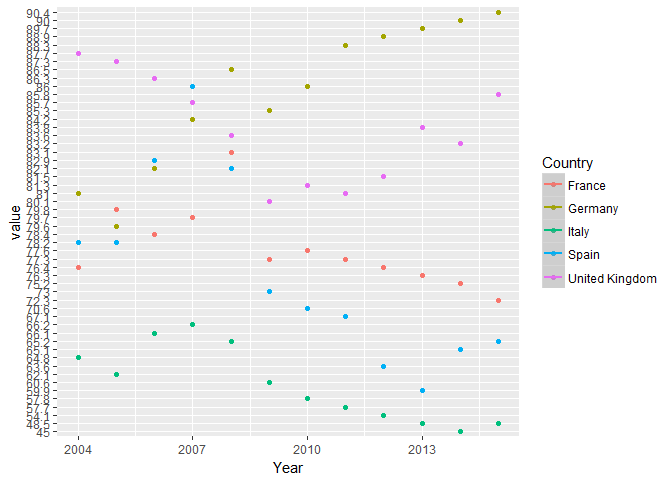

歐洲各國21世紀教育水平對比分析（付與移民傾向的聯合分析）
================

分析議題背景（陳堯奕）
----------------------

歐洲28國在進入21世紀對本國教育方面的重視程度及教育水平的變化，并將其移民傾向做對比。

分析動機
--------

我對歐洲近年來的一系列難民問題有一定的興趣，了解了一些各國移民的信息。同時在搜索資料的過程中也看到了不少關於各國教育方面有意思的數據。所以藉此機會我想對此進行分析，可能的話還可以找出一些兩者之間的關係。

使用資料
--------

資料來源為世界銀行網站，資料記錄了歐洲大部分國家21世紀的各項教育與移民數據。包括幼儿接受教育率、年度公共教育支出(Million PPS)、平均对每名学生的教育支出(PPS)、 本国国际学生（大学）人员流动性、中等教育水平学生平均掌握外语数、 教育支出占国家年度总GDP百分比、应届毕业生就业率率、国民终生受教育率、 20至24岁拥有高中学历人数比例、30至34岁拥有大学学历人数比例、Immigration、Emigration、Net Migration、Total Migration等。

載入使用資料

``` r
library(readxl)
```

    ## Warning: package 'readxl' was built under R version 3.3.3

``` r
ed1 <- read_excel("F:/大学课程/大数据/移民/教育综合1.xls")
ed2 <- read_excel("F:/大学课程/大数据/移民/教育综合2.xls")
ed3 <- read_excel("F:/大学课程/大数据/移民/个人受教育后就业率.xls")
ed4 <- read_excel("F:/大学课程/大数据/移民/移民表格已整理.xlsx")
```

資料處理與清洗
--------------

由於資料都是單獨搜索下載的，所以在Excel當中我事先整合處理了一下，寬表轉換成長表，共整理出4個表格。在RStudio當中把這4個表格整合為一份以便分析，並把所有欄位都轉換成數值。因為還未確定具體要分析的議題，所以整合是所有欄位和記錄都有保存（有空值的記錄先不處理）。還有部分資料處理為了方便我放在探索式資料分分析版塊。

處理資料

``` r
library(dplyr)
```

    ## Warning: package 'dplyr' was built under R version 3.3.3

    ## 
    ## Attaching package: 'dplyr'

    ## The following objects are masked from 'package:stats':
    ## 
    ##     filter, lag

    ## The following objects are masked from 'package:base':
    ## 
    ##     intersect, setdiff, setequal, union

``` r
library(reshape2)
```

    ## Warning: package 'reshape2' was built under R version 3.3.3

``` r
library(ggplot2) 
```

    ## Warning: package 'ggplot2' was built under R version 3.3.3

``` r
ed<-merge(ed1,ed2,all = T)
ed<-merge(ed,ed3,all = T)
ed<-merge(ed,ed4,all = T)
ed$'本国国际学生（大学）人员流动性'<-as.numeric(ed$'本国国际学生（大学）人员流动性')
```

    ## Warning: 强制改变过程中产生了NA

``` r
ed$'20至24岁拥有高中学历人数比例'<-as.numeric(ed$'20至24岁拥有高中学历人数比例')
```

    ## Warning: 强制改变过程中产生了NA

``` r
ed$`30至34岁拥有大学学历人数比例`<-as.numeric(ed$`30至34岁拥有大学学历人数比例`)
```

    ## Warning: 强制改变过程中产生了NA

``` r
ed$Immigration<-as.numeric(ed$Immigration)
```

    ## Warning: 强制改变过程中产生了NA

``` r
ed$Emigration<-as.numeric(ed$Emigration)
```

    ## Warning: 强制改变过程中产生了NA

``` r
ed$幼儿接受教育率<-as.numeric(ed$幼儿接受教育率)
```

    ## Warning: 强制改变过程中产生了NA

``` r
ed$`年度公共教育支出(Million PPS)`<-as.numeric(ed$`年度公共教育支出(Million PPS)`)
```

    ## Warning: 强制改变过程中产生了NA

``` r
ed$`平均对每名学生的教育支出(PPS)`<-as.numeric(ed$`平均对每名学生的教育支出(PPS)`)
```

    ## Warning: 强制改变过程中产生了NA

``` r
ed$国小师生比率<-as.numeric(ed$国小师生比率)
```

    ## Warning: 强制改变过程中产生了NA

``` r
ed$中等教育水平学生平均掌握外语数<-as.numeric(ed$中等教育水平学生平均掌握外语数)
```

    ## Warning: 强制改变过程中产生了NA

``` r
ed$教育支出占国家年度总GDP百分百<-as.numeric(ed$教育支出占国家年度总GDP百分百)
```

    ## Warning: 强制改变过程中产生了NA

``` r
ed$应届毕业生就业率<-as.numeric(ed$应届毕业生就业率)
```

    ## Warning: 强制改变过程中产生了NA

``` r
ed$国民终生受教育率<-as.numeric(ed$国民终生受教育率)
```

    ## Warning: 强制改变过程中产生了NA

``` r
ed$个人受教育后就业率<-as.numeric(ed$个人受教育后就业率)
```

    ## Warning: 强制改变过程中产生了NA

``` r
knitr::kable(ed[233:248,])
```

|     | Country |  Year| 幼儿接受教育率 | 在读大学生平均年龄 | 年度公共教育支出(Million PPS) | 平均对每名学生的教育支出(PPS) | 学生出国留学（大学）人员流动性 | 本国国际学生（大学）人员流动性 | 国小师生比率 | 中等教育水平学生平均掌握外语数 | 教育支出占国家年度总GDP百分百 | 应届毕业生就业率 | 国民终生受教育率 | 20至24岁拥有高中学历人数比例 | 30至34岁拥有大学学历人数比例 | 个人受教育后就业率 |   ID|  Immigration|  Emigration|  Net Migration|  Total Migration|
|-----|:--------|-----:|:--------------:|:-------------------|:-----------------------------:|:-----------------------------:|:-------------------------------|:------------------------------:|:------------:|:------------------------------:|:-----------------------------:|:----------------:|:----------------:|:----------------------------:|:----------------------------:|:------------------:|----:|------------:|-----------:|--------------:|----------------:|
| 233 | Denmark |  2000|       NA       | NA                 |            11216.0            |             7108.0            | NA                             |               NA               |      NA      |               NA               |              8.28             |        NA        |       19.4       |              NA              |             32.1             |         NA         |   NA|           NA|          NA|             NA|               NA|
| 234 | Denmark |  2001|      93.7      | 24.8               |            11402.0            |             7288.5            | 4.7                            |               5.2              |     10.2     |               NA               |              8.44             |        NA        |       18.4       |              NA              |             32.9             |         NA         |   NA|           NA|          NA|             NA|               NA|
| 235 | Denmark |  2002|      93.5      | 24.8               |            11897.1            |             7360.8            | 4.8                            |               5.6              |     10.9     |               NA               |              8.44             |        NA        |       18.0       |              NA              |             34.2             |         NA         |    4|        52778|       43481|           9297|            96259|
| 236 | Denmark |  2003|      94.9      | 24.9               |            11525.8            |             7115.0            | 5                              |               6.7              |     10.8     |               NA               |              8.33             |        NA        |       24.2       |              NA              |             38.2             |         NA         |   50|        49754|       43466|           6288|            93220|
| 237 | Denmark |  2004|      96.9      | 25.3               |            12365.9            |             7631.1            | 5.1                            |               7.3              |     11.3     |               2.0              |              8.43             |       82.6       |       25.6       |             76.2             |             41.4             |         NA         |   96|        49860|       45017|           4843|            94877|
| 238 | Denmark |  2005|      91.8      | 25.6               |            12476.5            |             8075.0            | 5                              |               8.7              |      NA      |               2.0              |              8.30             |       86.4       |       27.4       |             77.1             |             43.1             |         NA         |  142|        52458|       45869|           6589|            98327|
| 239 | Denmark |  2006|      92.0      | 25.5               |            12696.3            |             8385.8            | 5.5                            |               9.8              |      NA      |               2.0              |              7.97             |       89.0       |       29.2       |             77.4             |             43.0             |         NA         |  188|        56750|       46786|           9964|           103536|
| 240 | Denmark |  2007|      92.7      | 25.5               |            13036.8            |             8680.2            | 5.5                            |              10.8              |      NA      |               2.0              |              7.81             |       90.9       |       29.1       |             69.4             |             38.1             |         NA         |  234|        64656|       41566|          23090|           106222|
| 241 | Denmark |  2008|      91.8      | 25.2               |            13119.6            |             8907.0            | 5.2                            |              12.2              |     10.1     |               1.9              |              7.68             |       90.6       |       30.0       |             68.9             |             39.2             |         NA         |  280|        57357|       38356|          19001|            95713|
| 242 | Denmark |  2009|      91.9      | 25.2               |            13960.4            |             9148.7            | 5.4                            |              15.1              |      9.9     |               1.9              |              8.74             |       87.9       |       31.3       |             69.9             |             40.7             |         NA         |  326|        51800|       39899|          11901|            91699|
| 243 | Denmark |  2010|      98.1      | 24.8               |            15240.4            |             9589.2            | 5.5                            |              17.6              |     11.5     |               1.8              |              8.81             |       83.5       |       32.6       |             68.6             |             41.2             |         NA         |  372|        52236|       41456|          10780|            93692|
| 244 | Denmark |  2011|      97.9      | 24.6               |            15329.5            |             9665.1            | 5.7                            |              21.0              |     11.8     |               1.8              |              8.75             |       83.0       |       32.3       |             70.0             |             41.2             |         NA         |  418|        52833|       41593|          11240|            94426|
| 245 | Denmark |  2012|      98.0      | 24.5               |               NA              |               NA              | 5.9                            |              23.5              |     11.9     |               1.8              |               NA              |       84.1       |       31.6       |             72.0             |             43.0             |         NA         |  464|        54409|       43663|          10746|            98072|
| 246 | Denmark |  2013|       NA       | NA                 |               NA              |               NA              | NA                             |               NA               |      NA      |               NA               |               NA              |       81.9       |       31.4       |             71.8             |             43.4             |         NA         |  510|        60312|       43310|          17002|           103622|
| 247 | Denmark |  2014|       NA       | NA                 |               NA              |               NA              | NA                             |               NA               |      NA      |               NA               |               NA              |       83.7       |       31.9       |             72.5             |             44.9             |         NA         |   NA|           NA|          NA|             NA|               NA|
| 248 | Denmark |  2015|       NA       | NA                 |               NA              |               NA              | NA                             |               NA               |      NA      |               NA               |               NA              |       81.7       |       31.3       |             74.1             |             47.6             |         NA         |   NA|           NA|          NA|             NA|               NA|

資料量較大，這裡象征性的顯示其中幾筆資料（丹麥）。

探索式資料分析
--------------

``` r
年均人口流動總數<-group_by(ed,Country)%>%
  summarise(年均人口流動總數=mean(`Total Migration`,na.rm=T)) %>%
  arrange(desc(年均人口流動總數))
knitr::kable(年均人口流動總數)
```

| Country                                    | 年均人口流動總數 |
|:-------------------------------------------|:----------------:|
| Germany                                    |    1127102.333   |
| United Kingdom                             |    857900.167    |
| Spain                                      |    810051.583    |
| France                                     |    561768.875    |
| Italy                                      |    478091.750    |
| Romania                                    |    361359.000    |
| Russia                                     |    273817.667    |
| Switzerland                                |    234434.333    |
| Poland                                     |    221061.545    |
| Belgium                                    |    211006.900    |
| Netherlands                                |    207488.750    |
| Austria                                    |    153720.833    |
| Greece                                     |    140800.333    |
| Ireland                                    |    133337.500    |
| Sweden                                     |    132340.583    |
| Czech Republic                             |     99712.333    |
| Denmark                                    |     97472.083    |
| Uzbekistan                                 |     78026.000    |
| Norway                                     |     76194.167    |
| Portugal                                   |     64607.083    |
| Lithuania                                  |     49967.417    |
| Kyrgyzstan                                 |     48205.500    |
| Hungary                                    |     38649.667    |
| Finland                                    |     37827.333    |
| Latvia                                     |     30578.333    |
| Slovenia                                   |     29794.750    |
| Cyprus                                     |     28396.909    |
| Luxembourg                                 |     25707.833    |
| Croatia                                    |     24664.875    |
| Bulgaria                                   |     24495.000    |
| Belarus                                    |     23634.000    |
| Slovakia                                   |     13584.417    |
| Bosnia and Herzegovina                     |     12792.000    |
| Iceland                                    |     11790.500    |
| Tajikistan                                 |     9376.000     |
| Armenia                                    |     8980.500     |
| Malta                                      |     8712.333     |
| Estonia                                    |     7255.333     |
| Azerbaijan                                 |     5037.000     |
| Former Yugoslav Republic of Macedonia, the |     2684.286     |
| Liechtenstein                              |     1109.750     |
| San Marino                                 |      505.000     |
| Albania                                    |        NaN       |
| EU (27 countries)                          |        NaN       |
| EU (28 countries)                          |        NaN       |
| Euro area (17 countries)                   |        NaN       |
| Euro area (18 countries)                   |        NaN       |
| Euro area (19 countries)                   |        NaN       |
| Japan                                      |        NaN       |
| Montenegro                                 |        NaN       |
| Serbia                                     |        NaN       |
| Turkey                                     |        NaN       |
| United States                              |        NaN       |

``` r
歐盟28國平均數據<-filter(ed,Country %in%"EU (28 countries)")
for(i in 3:15){
歐盟28國平均數據[i]<-mean(歐盟28國平均數據[,i],na.rm = T)
}
```

    ## Warning in mean.default(歐盟28國平均數據[, i], na.rm = T): argument is not
    ## numeric or logical: returning NA

    ## Warning in mean.default(歐盟28國平均數據[, i], na.rm = T): argument is not
    ## numeric or logical: returning NA

``` r
knitr::kable(歐盟28國平均數據[1,-c(2,4,7,9,16,17,18,19,20,21)])
```

| Country           | 幼儿接受教育率 | 年度公共教育支出(Million PPS) | 平均对每名学生的教育支出(PPS) | 本国国际学生（大学）人员流动性 | 中等教育水平学生平均掌握外语数 | 教育支出占国家年度总GDP百分百 | 应届毕业生就业率 | 国民终生受教育率 | 20至24岁拥有高中学历人数比例 | 30至34岁拥有大学学历人数比例 |
|:------------------|:--------------:|:-----------------------------:|:-----------------------------:|:------------------------------:|:------------------------------:|:-----------------------------:|:----------------:|:----------------:|:----------------------------:|:----------------------------:|
| EU (28 countries) |     89.975     |            579837.8           |            5976.855           |            518.2455            |            1.516667            |             5.081             |       77.55      |     9.428571     |             79.5             |           31.74286           |

``` r
歐洲5國數據<-filter(ed,Country %in% c('Germany','United Kingdom','Spain',"France","Italy"))
歐洲5國平均數據<-group_by(歐洲5國數據,Country)%>%summarise(幼儿接受教育率=mean(幼儿接受教育率,na.rm=T),'年度公共教育支出(Million PPS)'=mean(`年度公共教育支出(Million PPS)`,na.rm=T),'平均对每名学生的教育支出(PPS)'=mean(`平均对每名学生的教育支出(PPS)`,na.rm=T),`本国国际学生（大学）人员流动性`=mean(`本国国际学生（大学）人员流动性`,na.rm=T),中等教育水平学生平均掌握外语数=mean(中等教育水平学生平均掌握外语数,na.rm=T),教育支出占国家年度总GDP百分比=mean(教育支出占国家年度总GDP百分百,na.rm=T),应届毕业生就业率率=mean(应届毕业生就业率,na.rm=T),国民终生受教育率=mean(国民终生受教育率,na.rm=T),'20至24岁拥有高中学历人数比例'=mean(`20至24岁拥有高中学历人数比例`,na.rm=T),'30至34岁拥有大学学历人数比例'=mean(`30至34岁拥有大学学历人数比例`,na.rm=T),Immigration=mean(Immigration,na.rm=T),Emigration=mean(Emigration,na.rm=T),'Net Migration'=mean(`Net Migration`,na.rm=T),'Total Migration'=mean(`Total Migration`,na.rm=T))
knitr::kable(歐洲5國平均數據)
```

| Country        | 幼儿接受教育率 | 年度公共教育支出(Million PPS) | 平均对每名学生的教育支出(PPS) | 本国国际学生（大学）人员流动性 | 中等教育水平学生平均掌握外语数 | 教育支出占国家年度总GDP百分比 | 应届毕业生就业率率 | 国民终生受教育率 | 20至24岁拥有高中学历人数比例 | 30至34岁拥有大学学历人数比例 |  Immigration|  Emigration|  Net Migration|  Total Migration|
|:---------------|:--------------:|:-----------------------------:|:-----------------------------:|:------------------------------:|:------------------------------:|:-----------------------------:|:------------------:|:----------------:|:----------------------------:|:----------------------------:|------------:|-----------:|--------------:|----------------:|
| France         |    100.00000   |            90883.00           |            6529.258           |            44.86667            |            1.500000            |            5.838571           |      77.48333      |     6.029167     |           84.16667           |           34.04348           |     309512.5|   252256.38|       57256.12|         561768.9|
| Germany        |    91.90000    |           101541.63           |            6635.025           |            116.32727           |            1.241667            |            4.660000           |      86.00000      |     6.910000     |           74.49167           |           26.97826           |     637366.1|   489736.25|      147629.83|        1127102.3|
| Italy          |    99.75833    |            64645.50           |            6175.691           |            16.95833            |            1.658333            |            4.716190           |      58.05000      |     5.312500     |           76.72500           |           15.22083           |     399976.4|    78115.33|      321861.08|         478091.8|
| Spain          |    98.73333    |            44752.98           |            5828.217           |            17.10000            |            1.400000            |            4.526500           |      72.65833      |     7.287500     |           62.60833           |           33.82917           |     555614.9|   254436.67|      301178.25|         810051.6|
| United Kingdom |    94.97500    |            82563.42           |            6841.992           |            146.62500           |            0.960000            |            5.199524           |      83.94167      |     19.545000    |           80.40833           |           34.50000           |     518792.8|   339107.42|      179685.33|         857900.2|

``` r
歐洲5國數據_長表<-melt(歐洲5國數據,id.vars = c("Country","Year"))
#ggplot(歐洲5國數據, 
#       aes(x = Year, 
#           y = 应届毕业生就业率)) + 
#    geom_point()+
#  facet_grid(Country~.)+
#    geom_smooth()
ggplot(filter(歐洲5國數據_長表,variable%in%"应届毕业生就业率",Year>2003), 
       aes(x = Year, 
           y = value,colour=Country),title(main ="5國应届毕业生就业率變化趨勢"))+   
    geom_point()+geom_smooth()
```

    ## `geom_smooth()` using method = 'loess'

    ## Warning in simpleLoess(y, x, w, span, degree = degree, parametric =
    ## parametric, : span too small. fewer data values than degrees of freedom.

    ## Warning in simpleLoess(y, x, w, span, degree = degree, parametric =
    ## parametric, : at 2013

    ## Warning in simpleLoess(y, x, w, span, degree = degree, parametric =
    ## parametric, : radius 0.0001

    ## Warning in simpleLoess(y, x, w, span, degree = degree, parametric =
    ## parametric, : all data on boundary of neighborhood. make span bigger

    ## Warning in simpleLoess(y, x, w, span, degree = degree, parametric =
    ## parametric, : pseudoinverse used at 2013

    ## Warning in simpleLoess(y, x, w, span, degree = degree, parametric =
    ## parametric, : neighborhood radius 0.01

    ## Warning in simpleLoess(y, x, w, span, degree = degree, parametric =
    ## parametric, : reciprocal condition number 1

    ## Warning in simpleLoess(y, x, w, span, degree = degree, parametric =
    ## parametric, : at 2015

    ## Warning in simpleLoess(y, x, w, span, degree = degree, parametric =
    ## parametric, : radius 0.0001

    ## Warning in simpleLoess(y, x, w, span, degree = degree, parametric =
    ## parametric, : all data on boundary of neighborhood. make span bigger

    ## Warning in simpleLoess(y, x, w, span, degree = degree, parametric =
    ## parametric, : There are other near singularities as well. 0.0001

    ## Warning in simpleLoess(y, x, w, span, degree = degree, parametric =
    ## parametric, : zero-width neighborhood. make span bigger

    ## Warning in simpleLoess(y, x, w, span, degree = degree, parametric =
    ## parametric, : zero-width neighborhood. make span bigger

    ## Warning: Computation failed in `stat_smooth()`:
    ## 外接函数调用时不能有NA/NaN/Inf(arg5)



在歐洲人員流動量最大的是德國、英國、西班牙、法國和意大利。因為歐洲國家較多，所以教育與移民的關係分析大致會以這5個國家為例。

列出歐洲28國的平均教育數據。

德國、英國、西班牙、法國、意大利五國的各項年平均數據,這裡舉例先列出5國应届毕业生就业率變化趨勢。

期末專題分析規劃
----------------

期末專題要分析歐洲教育水平的變化，不同教育數據對彼此的影響，以及各國（主要是移民5大國）教育水平與其移民傾向的關係。
